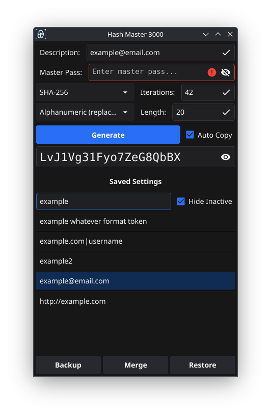

# About / Background / Cryptonos Legacy

I used Cryptnos (Jeffrey T. Darlington, www.cryptnos.com) for years. But the Android version became EOL years ago, and that was the last activity for any platform AFAIK.
As soon as I had a few problems running the old .NET codebase on a modern Linux install, I decided to say my goodbyes.

Hash Master 3000 (HM3k, nod Dilbert) is an implementation of the same great Cryptos idea, and functionaly compatible with all *my* old cyptnos settings (only the mainstream hashing algorithms), and *my* workflow. Your milage may vary.
I didn't use any Cryptnos code, just implemented the idea from scratch in Go with help from AI.

I leveraged all the built-in go crypto libs, and Fyne (Fyne.io) does all the heavy lifting. With a pinch of AI slop to glue it together, it's resulted in a surprisingly useful cross-platform UI with minimal effort from myself.
That being said, take this as it is: a sloppily implemented library plumbing exercise with ZERO guarantees, and ZERO support... But you may find it useful.

# Build
go mod init HashMaster3000
go mod tidy
go build -ldflags "-s -w"

# Package
go install fyne.io/tools/cmd/fyne@latest

### Package for Android 
fyne package --id link.multifarious.hm3k --release --icon HM3k.png -os android

### Package for Linux
fyne package --id link.multifarious.hm3k --release --icon HM3k.png -os linux
